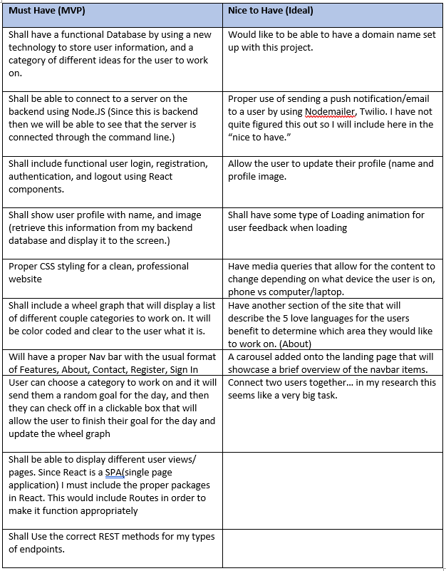
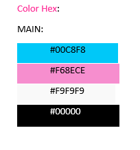
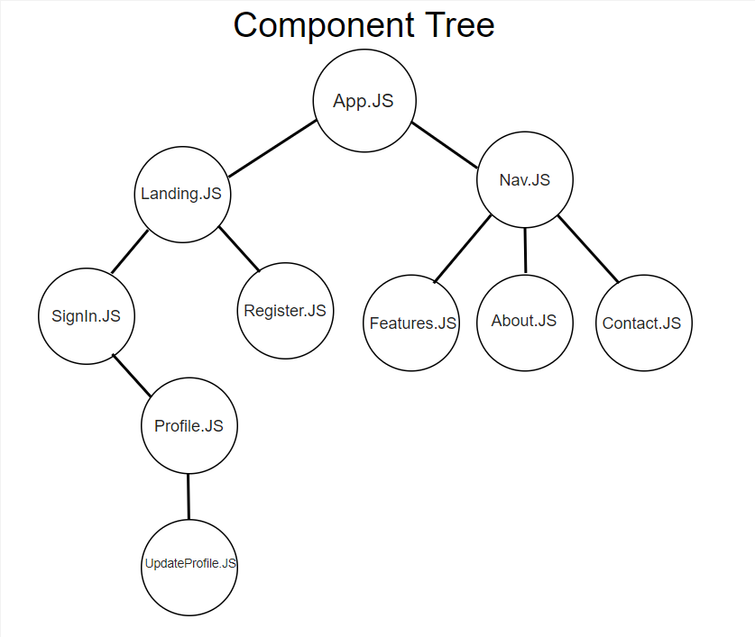
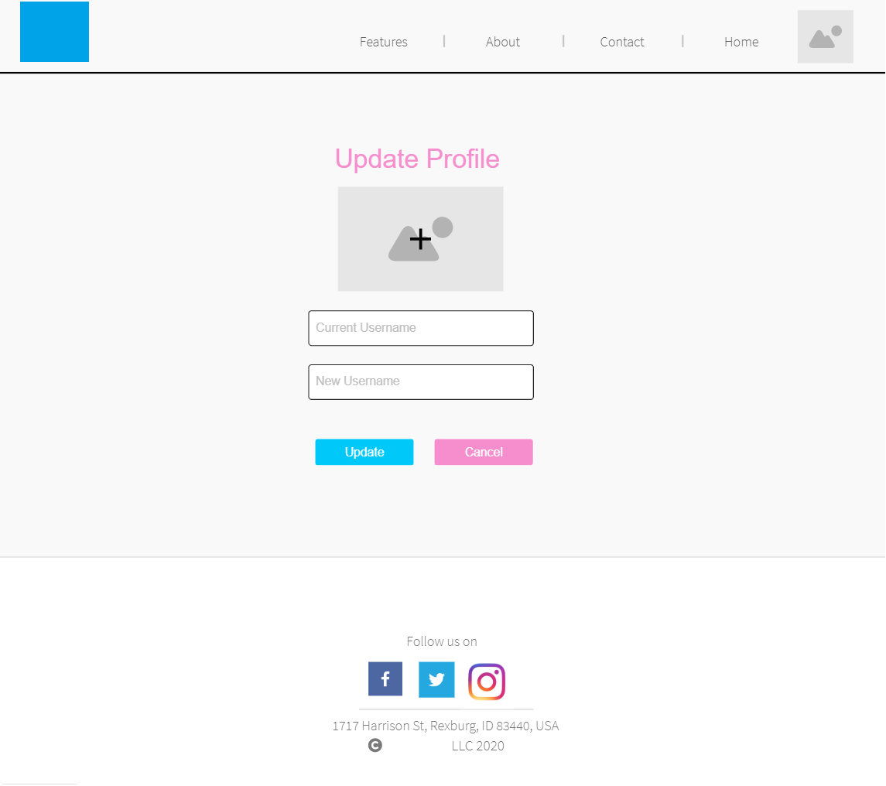

# Personal Project HeartTaken
## IDEA and USER:

In today’s world there are many dating applications that help you find that special someone, but what about an app to help strengthen that relationship once it has been established? I have decided to design an application called HeartTaken designed for those looking to strengthen their relationship, geared specifically towards married couples or those individuals dating. The application will give user simple ways to serve and love their significant other.

This would be a web application that would allow you as the user to sign in and create an account. From here you can pick a category you want to work on for the day. There will be a total of 5 categories (love languages) to choose from where you can get a suggestion of what to do for the day in that category. I would like to add in the functionality of sending push notifications or emails on ideas you can do to serve your significant other for that day in that specific category as well put for now I just want it marked off in the app itself. Once you have completed that task for the day you can mark it off. Throughout the week as you complete HeartTaken goals it will track what areas you have been working on and fill in a wheel meter for you to see your couple progress. You will also be able to look at your history associated with the progress wheel.

## Features:

## Website colors:

## View/ Controller:
### Wireframe (View)

### Landing.js (View)
- This will be the landing page where the user will come when first visiting my website. It will show a navbar with 5 view pages to see, "Features, About, Contact, Register, SignIn." In the center view it will show a nice quote to show the importance of this site with a Sign In button or a register button below. Next, it will have a carousel that will move through the navbar giving a brief explanation into the next clickable view. Then lastly a footer with social media pages and copyright. These last two features along with the navbar will presist in the log in and register components.

### SignIn.js (View) 
- This is the Sign in page where the user will be able to Sign into their already existing account. It will handle authentication along with a "cancel" option if the user wants to terminate signing in. Below is a route to the register page if the user needs to register. 
 

### Register.js (View)
- This is the Register page where the user will be able to register a new account and then be redirected back to the login component whos functionality was previously described above. This component will have similar functionality as the one above.

### Profile.js (View)
- Once the user is logged in, they will be directed to the profile page where they will be able to view their profile information(username, and profile pic), view the wheel chart of Relationship Goals already completed along with 5 love language buttons that will allow the user to grab a goal for the day in that chosen love language. Once they have completed a goal for the day then they can check it off which will in turn update the wheel. 

- In the example the user has clicked the "Affirmation" button and it now gets a "goal" from the database and populates the text field where is can be checked off. Notice as well a slight change for the navbar as there is no longer a "register" or "sign in" button but a home button. While the "View" image doesnt show it, there will also be a logout button.  

### UpdateProfile.js (View)
- The user will access this component view by clicking the profile image in the top right corner once signed in. Here the user will be able to update their username and profile picture after filling in the required field and clicking "Update" or to cancel it by clicking "Cancel." 

### Features.js (View)
-  This component is simple in that it will display main features to the application. Along with describing the "Why" of the application. It will help users gain a better purpose of this application and hopefully drawn them into signing up.

### About.js (View)
<<<<<<< HEAD
- This component will just show the user about Couple.ly and how it came to be.

=======
- This component will just show the user more information about the website HeartTaken and how it came to be.

>>>>>>> a7539b11a6a7dbb607f2926ab284d52926254610

### Contact.js (View)
- The contact component will be useful in that it HAS the potential to allow users to send me emails regarding the website’s functionality. If bugs are detected or errors occur on the site this will be helpful in allowing the user to provide some simple feedback. 

## Endpoints

Here I will list my URL, REST methods, and a sample of the data that is being sent or received for every endpoint in my application.

### Auth endpoints
- POST: push a new user to the database. app.post(`/auth/register`)
- POST: push an existing user to the database. app.post(`/auth/login`)
- GET: this will get the user from the database to login in. app.get(`/api/user`)
- DELETE: Can logout of the website. app.delete(`/api/logout`)
- PUT: Can update the username or profile picture. app.put(`/api/user`)

### Goals endpoints 
*Work in Progress...*
- PUT: The wheel chart will update when the checkbox is clicked. app.put(`/api/goal`)
- GET: This will get the Goal for the day when the button is clicked. app.put(`/api/goal`)
- DELETE: Can logout of the website. app.delete(`/api/logout`)

## Schema (Database Design):

*Work in Progress...*
